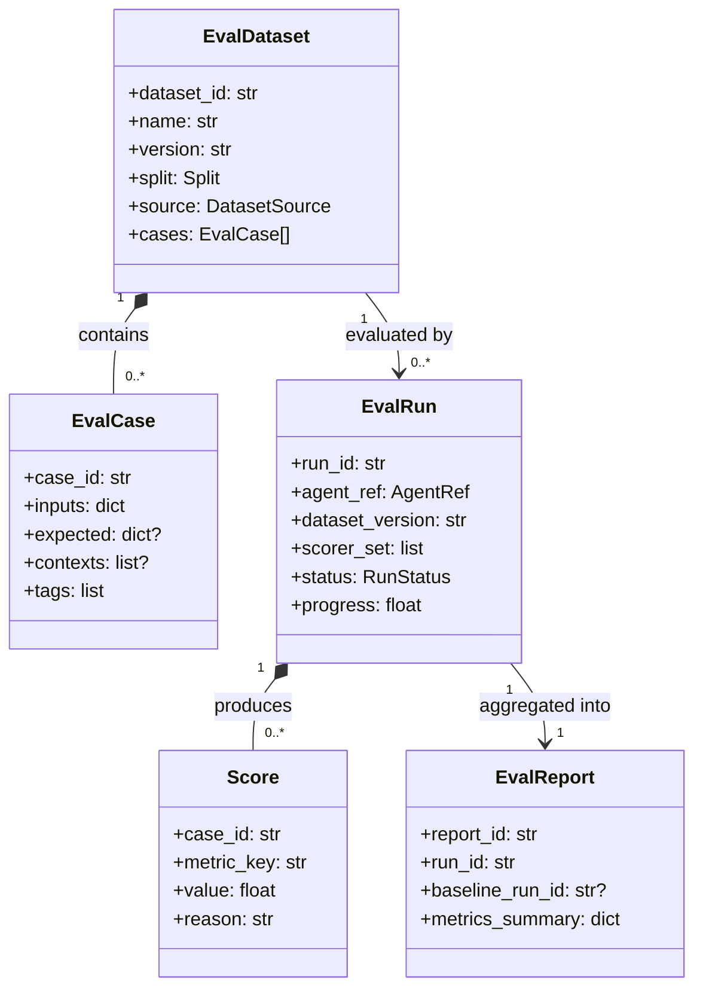
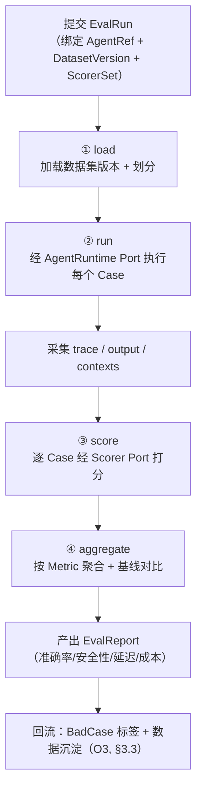
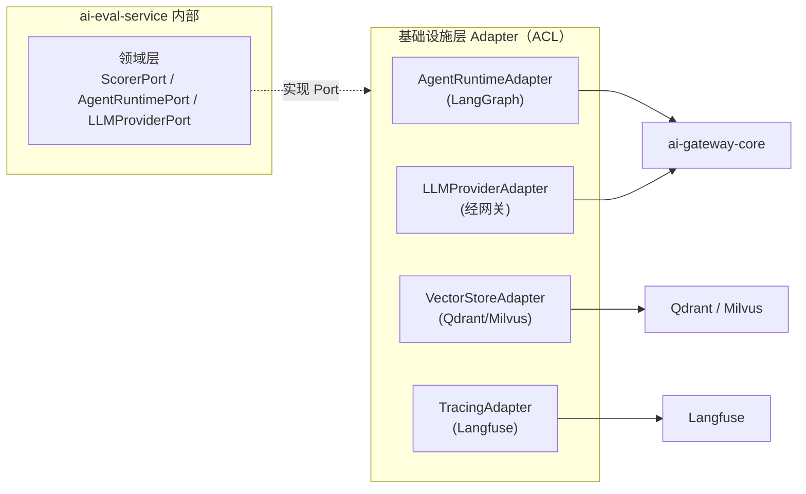
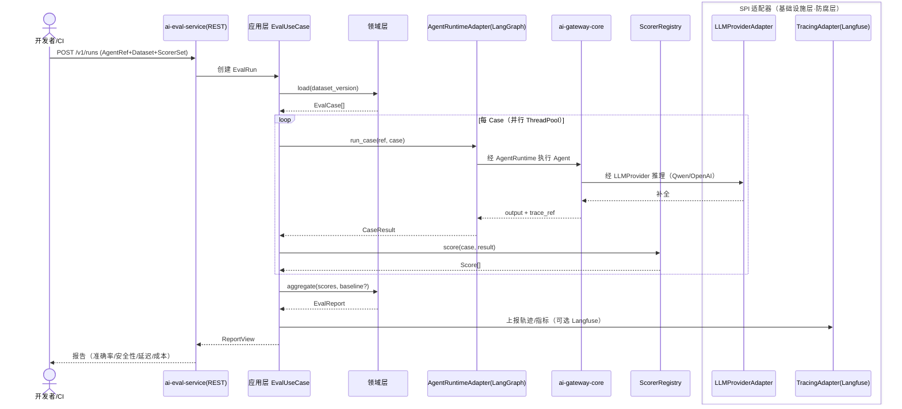
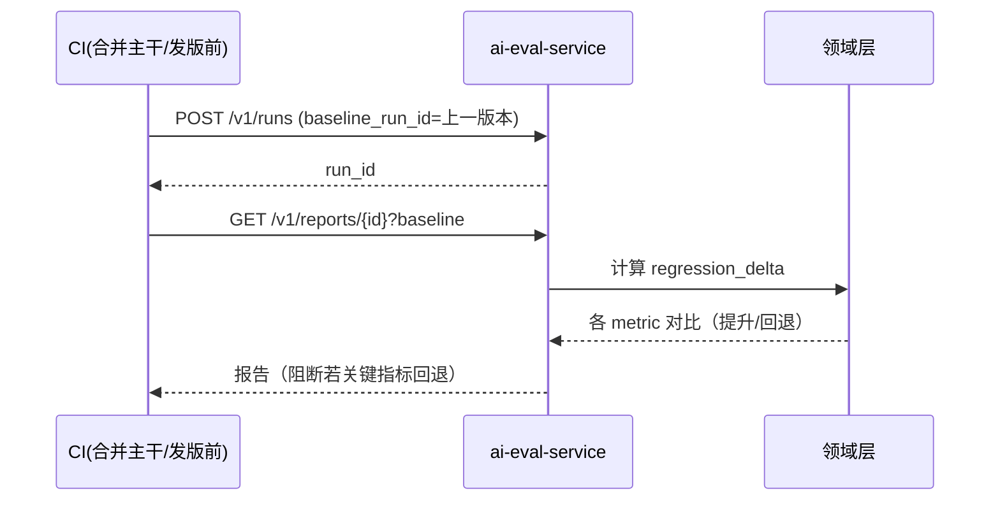
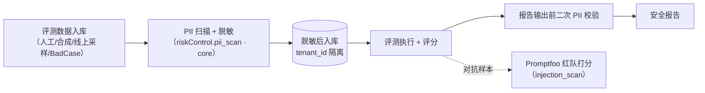

# ai-eval-service · 详细设计文档（DESIGN）

> 本文档是 `ai-eval-service` 的详细设计事实源，承接本仓 `arch/ARCH.md`（定位与边界）、`specs/SPECS.md`（契约）与 `skills/SKILLS.md`（编码技能），并严格对齐《OpenStrata 架构设计文档 v2.8》对应章节。重大设计决策以 ADR 沉淀于 `design/adr/`。

## 元信息（头部）

| 项 | 值 |
| --- | --- |
| **repo** | `ai-eval-service`（polyrepo：`github.com/openstrata/ai-eval-service`，tag `v1.4.0`） |
| **语言 · 框架** | Python · FastAPI + Pydantic v2 + Poetry（§15.6.1） |
| **领域（domain）** | ai-native（§15.2 / §15.2.1） |
| **可选性** | optional（默认关闭，阶段二 / E4 起按需点亮，§4.6 / §6 / §12.2） |
| **平台版本** | `v1.4.0`（对应 `openstrata-meta/repos.yaml`、`bom.yaml` 释出 `2026-07-15`） |
| **文档状态** | 草稿（Draft） |
| **负责人** | OpenStrata 架构组 |
| **关联链接** | 本仓：[arch/ARCH.md](./../arch/ARCH.md) · [skills/SKILLS.md](./../skills/SKILLS.md) · [specs/SPECS.md](./../specs/SPECS.md)；架构文档：§4.6（MLOps 与评测层）、§6（Agent 全生命周期）、§10.4（SPI 多实现）、§15.6（自研服务技术栈与 DDD 分层）、§16（发布管理与 BOM / Eval SPI） |

---

## 1. 定位与边界

`ai-eval-service` 是 OpenStrata 的**评测服务（Evaluation Service）**，位于 `ai-native` 域，是 Agent 全生命周期（§6）中"评测阶段（§6.3）"与"MLOps 与评测层（§4.6）"的工程承载者。它以 `Eval` SPI（`bom.yaml` 中 `interface_versions.Eval = 1.0.0`）为统一端口，将 Promptfoo / DeepEval / Ragas 等外部评测框架收敛为平台内可编排、可替换的评测能力。

**单一职责（只解决一件事）**：评估数据管理 + 评测执行 + 指标评分 + 报告聚合。它**不**负责 Agent 的在线推理、不负责线上流量监控（属 `ai-gateway-core` / Langfuse），也不负责模型训练（属 MLOps/MLflow，§4.6.1）。

**边界（与相邻服务的职责切分）**：

| 维度 | 本服务负责 | 相邻服务 / 组件负责 |
| --- | --- | --- |
| 在线对话 / 推理 | ❌ | `ai-gateway-core`（LLMProvider SPI，§4.4） |
| Agent 运行时编排 | ❌（仅"借"其执行被评对象） | `ai-gateway-core` + AgentRuntime（LangGraph，§4.2.1 / §15.6.1） |
| 线上 LLM 追踪 | ❌ | Langfuse（Tracing SPI，§4.8） |
| 评测数据**定义与执行** | ✅ | — |
| 评测报告**展示** | UI 由 `ai-portal-frontend` / `ai-admin-frontend` 承担 | 本服务仅产出结构化 Report |
| 模型微调 / 实验追踪 | ❌ | MLflow（MLOps SPI，§4.6.1，阶段四） |

**在分层中的位置**：属于"AI 原生"应用层能力，经 SPI 适配外部评测框架。跨服务协作遵循 §15.6.2.2——被 `ai-platform-api` 异步投递评测任务（图中 `EV`），产出报告回流。

---

## 2. 职责清单

按 DDD 应用层用例（§15.6.2）拆分，本服务对外承诺以下能力：

| # | 职责 | 说明 | 对应架构章节 |
| --- | --- | --- | --- |
| R1 | **评估数据集管理** | 数据集的创建 / 版本化 / 划分（Train·Eval·Test）/ 分布分析、Bad Case 入库 | §4.6.3 评测数据管理 |
| R2 | **评测用例（Case）管理** | 单条 Case 的输入 / 期望 / 上下文 / 标签（幻觉/安全/格式等归因标签） | §4.6.3 标签体系 |
| R3 | **评测任务编排** | 提交评测运行、绑定目标 Agent（AgentRuntime）、选择评分器集合、进度追踪 | §6.3 评测阶段 |
| R4 | **评测执行（Run）** | 加载数据 → 调用 AgentRuntime 执行 → 采集轨迹/输出 | §4.6.2 / §6.3 |
| R5 | **指标评分（Score）** | 通过可插拔 Scorer（Promptfoo/DeepEval/Ragas）对输出打分 | §16 Eval SPI |
| R6 | **结果聚合与报告** | 聚合指标、生成 Report（准确率/安全性/延迟/成本等），支持回归对比 | §4.6.2 评测体系 |
| R7 | **回归 / 安全 / RAG 评测** | 提供回归对比、红队注入（Promptfoo Red Team）、RAG 忠实度等专项评测 | §6.3 / §4.6.2 |
| R8 | **PII 与数据安全** | 评测数据集的 PII 扫描、脱敏、访问隔离 | §4.7.4 基础风控（core） |

> 可选性：R1–R7 全部 `optional`，随 `openstrata.yaml` 的 `eval` 开关点亮（§12.1）。PII 扫描（R8）复用平台基础风控 `riskControl.pii_scan`（§12.1 core 基线），本服务接入其端口而非自研。

---

## 3. 领域概念与模型（Eval Dataset / Case / Metric / Report）

领域层（§15.6.2 ③）以**纯逻辑、零外部依赖**的方式定义以下聚合与实体。核心聚合根：`EvalDataset`、`EvalRun`、`EvalReport`。

### 3.1 领域词汇

| 概念 | 含义 | 关键属性 |
| --- | --- | --- |
| **EvalDataset** | 一组评测用例的集合，带版本 | `dataset_id`、`name`、`version`、`split`（train/eval/test）、`source`（人工/合成/线上采样/BadCase）、分布元数据 |
| **EvalCase** | 单条评测用例 | `case_id`、`inputs`、可选 `expected`/`reference`、RAG `contexts`、归因 `tags` |
| **Metric** | 一个评分维度（如 准确率 / 忠实度 / 幻觉率） | `metric_key`、`scorer`、`direction`（max/min）、阈值 |
| **Score** | 某 Case 在某 Metric 下的得分 | `case_id`、`metric_key`、`value`、`reason`、`trace_ref` |
| **EvalRun** | 一次评测执行（绑定数据集 + Agent + 评分器集） | `run_id`、`agent_ref`、`dataset_version`、`status`、`progress` |
| **EvalReport** | 一次 Run 的聚合结果 | `report_id`、`run_id`、各 Metric 聚合值、对比基线 |

### 3.2 聚合关系（Mermaid）



### 3.3 领域约束（示例）

- `EvalDataset` 的 `version` 由领域服务在每次内容变更时自增（语义化，对接 §6.4 版本管理）。
- `EvalRun.status` 状态机：`pending → running → scoring → aggregated → done | failed`。
- `Score.value` 必须落在 Scorer 声明的 `[min, max]`，否则领域层拒绝并标记 Run 为 `failed`。

---

## 4. 评估流水线（load → run（绑定 AgentRuntime） → score → aggregate）

评测执行是应用层的一个核心用例（`EvalUseCase`），按四阶段串行推进，每阶段可水平扩展（并行评测用 ThreadPool / Ray，见 §15.6.1 Python 技术栈注）。



### 4.1 各阶段要点

| 阶段 | 输入 | 处理 | 输出 | 扩展点 |
| --- | --- | --- | --- | --- |
| **load** | `dataset_version`、划分规则 | 从 Repository 加载 Case，按 `split` 切分 | `EvalCase[]` | 数据源可插拔（PG / 对象存储 / 合成生成器） |
| **run** | `EvalCase[]`、`AgentRef` | 经 `AgentRuntimePort` 调用目标 Agent，传入 `inputs`/`contexts` | `CaseResult{output, trace_ref, latency, cost}` | AgentRuntime 适配器（LangGraph 等，§10.3 I3） |
| **score** | `CaseResult[]`、`ScorerSet` | 对每个 Case 并行调用各 `ScorerPort` | `Score[]` | **评分器插件**（§5） |
| **aggregate** | `Score[]`、可选 `baseline_run_id` | 按 `metric_key` 聚合（mean/P95/通过率），与基线 diff | `EvalReport` | 报告渲染（Grafana/Markdown/Langfuse） |

### 4.2 与 AgentRuntime 的绑定（run 阶段核心）

评测不是"再实现一个 Agent"，而是**借平台已有的 AgentRuntime 去跑被评对象**。应用层持有一个 `AgentRuntimePort`（领域层定义、基础设施层以 LangGraph 适配器实现，对接 §4.2.1 / §15.6.1），通过 `AgentRef`（含 `agent_id`、`tenant_id`、版本）定位目标 Agent，复用其工具 / 记忆 / 提示词配置，保证"评测即真实运行"。

```python
# 领域端口（§15.6.2 ③ 仅定义接口，不依赖实现）
class AgentRuntimePort(Protocol):
    def run_case(self, ref: AgentRef, case: EvalCase) -> CaseResult:
        """调用目标 Agent 执行单条评测用例，返回输出与可观测轨迹引用。"""
        ...
```

---

## 5. 指标与评分器设计（pluggable scorers，映射 §16 Eval SPI）

评分器是"可插拔"的核心落点：领域层定义 **`ScorerPort`**，每个外部评测框架作为**适配器（Adapter）**实现该端口（§10.3 I8 `EvalEngine` → `Promptfoo / DeepEval / OpenCompass`；本服务聚焦前两者 + Ragas）。新增一个评分维度 = 新增一个 Adapter，**领域层与已有用例零改动**（依赖倒置 DIP，§15.6）。

### 5.1 Scorer 端口与注册

```python
class ScorerPort(Protocol):
    scorer_key: str                       # 如 promptfoo_security / deepeval_hallucination / ragas_faithfulness
    supported_metrics: list[str]
    def score(self, case: EvalCase, result: CaseResult) -> list[Score]: ...

# 注册表（ProviderSelector，§10.3）：按 run 的 scorer_set 选择已注册 Adapter
class ScorerRegistry:
    def get(self, scorer_key: str) -> ScorerPort: ...
```

### 5.2 评分器 ↔ §16 BOM Eval 组件映射

取自 `openstrata-meta/bom.yaml` 的 `eval` capability（interface_version `Eval: 1.0.0`）：

| Scorer（Adapter） | BOM 组件 | version | license | status | enabled_by_default | SPI | 评测维度（§4.6.2） |
| --- | --- | --- | --- | --- | --- | --- | --- |
| `PromptfooScorer` | **promptfoo** | `0.90.0` | MIT | **core** | ✅（默认） | `Eval` | 准确率 / 安全性 / 一致性 / 红队注入 |
| `DeepEvalScorer` | **deepeval** | `2.0.0` | Apache-2.0 | optional | ❌ | `Eval` | 幻觉率 / 毒性 / 偏见 / 格式 |
| `RagasScorer` | **ragas** | `0.2.0` | MIT | optional | ❌ | `Eval` | 忠实度 / 答案相关性 / 上下文精度 |

> 镜像 §10.4 "多实现并存"：三种 Scorer 可同时注册、`run` 时按需组合。`promptfoo` 为 core 默认，DeepEval/Ragas 为 optional（点亮即生效，零代码改动）。这与 advanced/full profile 中 `eval: [promptfoo, deepeval, ragas]`（§12.2）一致。

### 5.3 扩展点契约（新增评分器步骤）

1. 在 `infrastructure/adapters/` 实现 `ScorerPort`，封装对应框架 CLI/SDK（`promptfoo eval` / `deepeval test run` / `ragas.evaluate`）。
2. 以 `scorer_key` 注册到 `ScorerRegistry`（经依赖注入，§15.6.2）。
3. 若需新 Metric，在领域层 `Metric` 枚举声明 `metric_key` + 方向 + 阈值；聚合逻辑自动覆盖。
4. 提供 SPI 契约测试（§12 兼容性 / §16.1），确保不破坏 `Eval: 1.0.0` 端口。

```yaml
# 评测运行请求中的 scorer_set 选择（对应 §6.3 评测类型）
scorer_set:
  - promptfoo_accuracy        # core 默认
  - promptfoo_security        # 红队/注入（§6.3 安全评测）
  - deepeval_hallucination    # optional，点亮 deepeval 后可用
  - ragas_faithfulness        # optional，RAG 场景（§4.6.2）
```

---

## 6. 与 LLM / 向量库 / 模型供给的集成（Adapter）

评测服务本身**不持有**模型与向量能力，全部经对应 SPI 的 Adapter（防腐层 ACL，§15.6.2）接入，保证同类多实现可切换、外部语义不泄漏。

| 依赖能力 | SPI 端口 | 默认 ✅ / 备选（bom.yaml） | 本服务用途 | 适配器落地 |
| --- | --- | --- | --- | --- |
| 模型供给 | `LLMProvider`（`1.0.0`） | Qwen/OpenAI/Claude ✅ / 自托管 vLLM·TGI（阶段四·full） | 评测中 Agent 的推理调用；亦可用于**合成数据生成**（§4.6.3） | `LLMProviderAdapter` 经 `ai-gateway-core` 统一出口 |
| 向量检索 | `VectorStore`（`1.1.0`） | Qdrant ✅ / Milvus（optional） | RAG 评测（Ragas）需检索上下文忠实度 | `VectorStoreAdapter` |
| Agent 运行时 | `AgentRuntime`（`1.3.0`） | LangGraph ✅（Python）/ Spring AI ✅（Java） | 执行被评 Agent（§4.2 run 阶段） | `AgentRuntimeAdapter`（LangGraph） |
| LLM 追踪 | `Tracing` | Langfuse ✅（MIT，optional） | 评测轨迹留痕、报告关联（§4.8） | `TracingAdapter` |
| 缓存 / KV | `Cache`（`1.0.0`） | Redis ✅ / Valkey（optional·OSI） | 任务状态、评分结果临时缓存 | `CacheAdapter` |
| 认证授权 | `Auth`（`1.0.0`） | Keycloak ✅ | 数据集/报告的租户隔离与访问控制 | `AuthAdapter` |



> 与 §4.4.4 模型供给一致：阶段一~三仅第三方 LLM API（无需 GPU）；自托管推理（vLLM）仅阶段四 full 档点亮。评测需要"本地模型跑分"时，同样经 `LLMProvider` SPI 切换，对评测用例零改动。

---

## 7. API 设计（REST / SDK 契约）

接入层（§15.6.2 ①）用 FastAPI 暴露 REST，Pydantic v2 作 Schema 与校验。所有写接口经 `Auth` Port 注入租户上下文（`tenant_id` 来自 Keycloak Token，§4.7）。

### 7.1 REST 端点（契约概要）

| 方法 | 路径 | 用例 | 说明 |
| --- | --- | --- | --- |
| `POST` | `/v1/datasets` | R1 | 创建数据集 |
| `GET` | `/v1/datasets/{id}?version=` | R1 | 获取数据集（含版本） |
| `POST` | `/v1/datasets/{id}/cases` | R2 | 新增评测用例 |
| `POST` | `/v1/runs` | R3/R4 | 提交评测运行（绑定 AgentRef + 数据集版本 + scorer_set） |
| `GET` | `/v1/runs/{run_id}` | R3 | 查询运行进度 |
| `POST` | `/v1/runs/{run_id}/cancel` | R3 | 取消运行 |
| `POST` | `/v1/runs/{run_id}/score` | R5 | 触发/重跑评分（可指定 scorer 子集） |
| `GET` | `/v1/reports/{report_id}` | R6 | 获取聚合报告（支持 `?baseline=run_id` 回归对比） |
| `GET` | `/v1/reports/{report_id}/export?fmt=md\|json\|grafana` | R6 | 报告导出 |

### 7.2 关键请求 / 响应 Schema（Pydantic v2）

```python
from pydantic import BaseModel, Field
from enum import Enum

class Split(str, Enum):
    train = "train"; eval = "eval"; test = "test"

class AgentRef(BaseModel):
    agent_id: str
    tenant_id: str
    version: str | None = None          # 不填则取当前线上版本

class RunCreate(BaseModel):
    dataset_id: str
    dataset_version: str
    agent: AgentRef
    scorer_set: list[str] = Field(..., min_length=1)   # 见 §5.3
    split: Split = Split.eval
    baseline_run_id: str | None = None   # 回归对比基线

class RunStatus(str, Enum):
    pending = "pending"; running = "running"; scoring = "scoring"
    aggregated = "aggregated"; done = "done"; failed = "failed"

class RunView(BaseModel):
    run_id: str
    status: RunStatus
    progress: float = Field(ge=0, le=1)
    metrics_summary: dict = {}

class ReportView(BaseModel):
    report_id: str
    run_id: str
    baseline_run_id: str | None
    metrics_summary: dict[str, float]      # metric_key -> 聚合值
    regression_delta: dict[str, float] | None
```

### 7.3 SDK 契约（面向 `ai-sdk-python` 消费方）

```python
from openstrata.sdk import EvalClient
client = EvalClient(base_url="http://ai-eval-service", token="<keycloak-token>")
run = client.runs.create(
    dataset_id="qa-golden", dataset_version="v3",
    agent={"agent_id": "customer-service", "tenant_id": "t-b"},
    scorer_set=["promptfoo_accuracy", "deepeval_hallucination"],
)
report = client.reports.wait(run.run_id)      # 轮询至 done
print(report.metrics_summary)
```

> 兼容性承诺（呼应 §16.1 SemVer）：本服务 REST 前缀 `/v1`、SPI `Eval: 1.0.0`；破坏性变更须 bump `MAJOR` 并附 ADR（见 `design/adr/`）。

---

## 8. 数据模型与存储（数据集 / 结果）

存储遵循 §4.9 底座：`PostgreSQL 16`（关系/结构化）+ `Redis 7.4`（任务状态/缓存，Valkey 为 OSI 备选）。领域层定义 **`EvalRepositoryPort`**，基础设施层以 SQLAlchemy 实现（§15.6.3 Python 目录 `infrastructure/`）。

### 8.1 核心表（逻辑模型）

```sql
-- 评估数据集（版本化，呼应 §4.6.3 DVC 版本追踪思路，落 PG）
CREATE TABLE eval_dataset (
    dataset_id   TEXT,
    version      TEXT,
    name         TEXT,
    source       TEXT,            -- human|synthetic|online_sample|badcase
    split        TEXT,
    dist_meta    JSONB,           -- 类别/长度/难度分布
    tenant_id    TEXT,
    created_at   TIMESTAMPTZ DEFAULT now(),
    PRIMARY KEY (dataset_id, version)
);

-- 评测用例
CREATE TABLE eval_case (
    case_id    TEXT PRIMARY KEY,
    dataset_id TEXT,
    version    TEXT,
    inputs     JSONB,
    expected   JSONB,
    contexts   JSONB,            -- RAG 场景检索上下文
    tags       TEXT[],           -- 归因标签：hallucination|security|format|...
    FOREIGN KEY (dataset_id, version) REFERENCES eval_dataset
);

-- 评测运行
CREATE TABLE eval_run (
    run_id        TEXT PRIMARY KEY,
    agent_ref     JSONB,
    dataset_id    TEXT,
    dataset_version TEXT,
    scorer_set   TEXT[],
    status        TEXT,
    progress      REAL,
    tenant_id     TEXT,
    baseline_run_id TEXT
);

-- 单条得分
CREATE TABLE eval_score (
    run_id     TEXT,
    case_id    TEXT,
    metric_key TEXT,
    value      REAL,
    reason     TEXT,
    PRIMARY KEY (run_id, case_id, metric_key)
);

-- 聚合报告
CREATE TABLE eval_report (
    report_id       TEXT PRIMARY KEY,
    run_id          TEXT,
    baseline_run_id TEXT,
    metrics_summary JSONB,
    regression_delta JSONB
);
```

### 8.2 存储分工

| 数据 | 存储 | 说明 |
| --- | --- | --- |
| 数据集 / 用例 / 运行 / 得分 / 报告 | PostgreSQL | 持久化事实源；版本化靠 `(dataset_id, version)` 复合主键 |
| 运行进度 / 评分中间结果缓存 | Redis | 高并发读写、幂等去重 |
| 大规模合成数据 / 轨迹附件 | 对象存储（MinIO，optional） | 大体积不落 PG |
| 实验指标历史（可选） | MLflow（阶段四 MLOps） | 跨版本趋势，对接 §4.6.1 |

> 数据集划分（Train/Eval/Test）为**逻辑划分**（按 `split` 列 + 配置化规则，§4.6.3），不物理复制，降低存储成本。

---

## 9. 关键时序（Mermaid）

### 9.1 提交评测运行 → 报告回流（端到端，呼应 §15.6.2.2）



### 9.2 回归评测（版本发布前，§6.3）



---

## 10. 配置 / 部署（通常 CPU，阶段四可选 GPU）

### 10.1 配置片段（本仓 `infrastructure/config/`，呼应 §15.7.3）

本仓只持有**局部配置片段**，全局由元仓 `openstrata-meta/dependencies/config/` 渲染（§15.7）。片段示例：

```yaml
# ai-eval-service/infrastructure/config/eval.yaml
eval:
  enabled: true
  # 评分器开关：core 默认开 promptfoo，optional 按需点亮（§16 / §12.2）
  scorers:
    promptfoo:  { enabled: true,  version: "0.90.0" }
    deepeval:   { enabled: false, version: "2.0.0" }   # optional
    ragas:      { enabled: false, version: "0.2.0" }   # optional
  execution:
    concurrency: 16            # 并行评测线程数
    backend: threadpool        # threadpool | ray（大数据集）
  storage:
    postgres: { dsn_env: PGDSN }
    redis:    { enabled: true }   # core；合规场景可切 valkey
  integrations:
    agentRuntime: langgraph        # 对应 AgentRuntime SPI 默认
    llmProvider:  [qwen-cloud, openai]   # 经 ai-gateway-core
    vectorStore:  qdrant                # RAG 评测用，可切 milvus
    tracing:      langfuse              # optional
```

### 10.2 部署形态（§12.2 四档预制）

| Profile | 阶段 | 是否含本服务 | 形态 / 资源 |
| --- | --- | --- | --- |
| `starter` | 一·尝鲜 | ❌ 默认关 | 通常无需评测（§6 "最小只需构建+运营"） |
| `standard` | 二·增强 | 可选（点亮 `eval`） | K8s 单租户，**CPU 为主** |
| `advanced` | 三·规模化治理 | ✅ 含（`eval: [promptfoo, deepeval, ragas]`） | 多团队共享，CPU |
| `full` | 四·工程化与自治 | ✅ 含（全量 Eval） | + 自托管推理需 **GPU 节点**（仅评测本地模型时） |

> **资源定性**：评测执行（跑 Agent、打分）通常为 **CPU 负载**；仅当被评对象使用**自托管模型（local-qwen-vllm，§11.2 阶段四）** 时，才经 `LLMProvider` 触发 GPU 推理——本服务本身无 GPU 硬依赖（§4.4.4 / §4.9 GPU 调度仅阶段四生效）。

### 10.3 容器与交付物（§15.7.2）

- `Dockerfile`：`python:3.12-slim` 基础镜像，Poetry 安装依赖；无状态优先，配置外置。
- `helm/`：Deployment + Service + （可选）HPA；与 `profiles/*.yaml` 联动渲染（§12.4 依赖校验：`eval` 点亮需 `agentRuntime` 与 `modelProvider` 已开）。
- 调度：`advanced/full` 下可配 Kueue 队列（§4.9），与自托管推理共享 GPU 池（仅 full）。

---

## 11. 可观测性 / 安全（评测数据 PII 处理）

### 11.1 可观测性（§4.8）

| 支柱 | 选型 | 本服务落地 |
| --- | --- | --- |
| 基础 Tracing + Audit（**core**） | OpenTelemetry + 不可变审计日志 | 每次 Run/Score 打 OTel Span（含 `run_id`/`tenant_id`/`agent_id`）；所有写操作留痕审计 |
| Metrics（推荐） | Prometheus + Grafana | 暴露 `eval_runs_total`、`eval_score_latency`、`scorer_errors`；报告可直接 `export?fmt=grafana` |
| LLM 专项 Tracing（optional） | Langfuse | 经 `TracingAdapter` 关联评测轨迹与线上链路（§4.8 示例的 `agent_execution` Span 体系） |

### 11.2 安全与评测数据 PII 处理（§4.7.4）

评测数据往往含真实用户语料（线上采样 1%、Bad Case，§4.6.3），PII 处理是核心安全项：

| 措施 | 实现 | 性质 |
| --- | --- | --- |
| **PII 扫描 + 脱敏** | 接入平台基础风控 `riskControl.pii_scan`（§12.1 **core 默认开**）端口，入库前对 `inputs`/`expected` 做 NER 检测与掩码 | core |
| **注入 / 越狱检测** | 复用 `riskControl.injection_scan`（§4.7.4）；评测数据集中的对抗样本经 `promptfoo` 红队打分 | core |
| **频率异常 / 限流** | `riskControl.rate_limit` 保护评测 API | core |
| **租户隔离** | 所有数据集/报告表带 `tenant_id`，经 `Auth` Port（Keycloak）强制行级隔离 | core |
| **输出敏感信息检测** | 评分后结果经 `pii_scan` 二次校验，避免报告泄露原始 PII | core |
| **高级护栏（可选）** | 幻觉检测 / 合规规则 / 人工审批（§4.7.4 optional）由 `security` 开关启用 | optional |



> **设计原则**：本服务**不自研** PII/注入检测，统一经平台基础风控端口（§4.7.4 core 基线），避免重复与策略漂移；仅在端口之上声明"评测数据必须过 PII 关卡"这一领域约束。

---

## 12. 测试策略

遵循 §15.6.5"领域层纯逻辑可脱离框架单测" + §15.6.2 横切约定。分三层：

| 层 | 类型 | 范围 | 工具 / 方式 |
| --- | --- | --- | --- |
| 领域层 | **单元测试** | `EvalDataset` 版本化、`Score` 区间校验、状态机、聚合算法 | pytest（纯函数，无 DB/框架） |
| 基础设施层 | **集成测试** | Adapter 真实行为：PostgreSQL（Testcontainers）、Redis、Promptfoo CLI 调用 | pytest + testcontainers；DeepEval/Ragas 以 mock LLM 跑通 |
| SPI / 端口 | **契约测试** | `ScorerPort` / `AgentRuntimePort` / `EvalRepositoryPort` 实现满足端口签名与 `Eval: 1.0.0` 语义 | 端口一致性断言 + bom 版本校验（§16.1） |
| 端到端 | **E2E** | `POST /v1/runs` → 报告，使用 fake Agent Adapter（不调真实 LLM） | FastAPI TestClient + 内存 Repository |

**回归红线**：CI 中集成"评测自身评测"——本服务每次发版前跑一组 golden dataset，关键 metric 回退则阻断（呼应 §6.3 回归测试 + §11.2）。

**兼容性测试**：评分器 Adapter 升级时校验 `bom.yaml` `interface_versions.Eval = 1.0.0` 不变（§16.1 SemVer）。

---

## 13. 开放问题

1. **GPU 边界**：评测本地自托管模型（vLLM）时的 GPU 调度/配额归属——本服务是否直接持有 GPU 负载，还是始终经 `ai-gateway-core` 的 `modelServing` 远程调用？（倾向后者，保持本服务无 GPU 硬依赖，§10.2）
2. **多租户数据集隔离粒度**：`advanced` 档多团队共享时，数据集是"租户级隔离"还是"团队/项目级"？需与 `ai-platform-api` 的租户模型（§8.1 / §14）对齐确认。
3. **Ragas 与 VectorStore 的耦合**：RAG 评测需要检索上下文（§4.6.2 忠实度/上下文精度），是否强制要求 `vectorStore` 已点亮？与 §12.4 依赖校验如何声明（`rag` 依赖 `memory`/`vectorStore`，评测是否同理）。
4. **报告存储与长期趋势**：跨版本指标趋势是落 PG、还是统一进 MLflow（阶段四 MLOps）？需与 `mlops` 开关（§12.1）明确归属，避免双写。
5. **合成数据生成的责任边界**：§4.6.3 合成数据由"LLM 自动生成 + 人工审核"，生成器逻辑放本服务还是 `ai-srs-service` / 独立 Job？建议本服务仅消费合成数据，生成归外部管道。
6. **Eval SPI 与 OpenCompass 的关系**：§10.3 I8 列举 `EvalEngine → Promptfoo/DeepEval/OpenCompass`，但 §4.6.2 / bom.yaml 的 `eval` capability 仅含 promptfoo/deepeval/ragas。OpenCompass（模型级评测）是否纳入本服务 Scorer 体系，还是仅作 `modelServing` 侧能力，需架构组裁决。

---

## 变更记录

| 版本 | 日期 | 作者 | 说明 |
| --- | --- | --- | --- |
| v0.1（草稿） | 2026-07-17 | OpenStrata 架构组 | 基于架构 v2.8 §4.6/§6/§10.4/§15.6/§16 与 `bom.yaml` 初版撰写 13 节详细设计 |

## 追溯矩阵（本文档章节 ↔ 架构设计文档 § 编号）

| 本文档章节 | 架构设计文档对应 § | 关键映射点 |
| --- | --- | --- |
| §1 定位与边界 | §4.6 / §6 / §15.6.1 | ai-native 域；Eval 为 MLOps 与评测层承载 |
| §2 职责清单 | §4.6.3 / §6.3 / §12.1 | 评估数据管理 / 评测阶段用例 |
| §3 领域概念 | §4.6.2 / §4.6.3 | Dataset/Case/Metric/Report；标签体系、版本化 |
| §4 评估流水线 | §6.3 / §4.6.2 / §15.6.2.2 | load→run→score→aggregate；绑定 AgentRuntime |
| §5 评分器设计 | §16（Eval SPI）/ §10.3 / §10.4 | promptfoo/deepeval/ragas ↔ BOM；多实现并存 |
| §6 外部集成 | §4.4.4 / §4.4.1 / §10.3 / §15.6.2 | LLMProvider / VectorStore / AgentRuntime / Tracing Adapter(ACL) |
| §7 API 设计 | §15.6.1 / §15.6.2 ① / §16.1 | FastAPI+Pydantic v2；/v1 与 Eval:1.0.0 |
| §8 数据模型 | §4.9 / §4.6.3 / §15.6.3 | PG16 + Redis；版本化复合主键 |
| §9 关键时序 | §15.6.2.2 / §6.3 / §4.8 | 跨服务 SPI 调用；回归评测 |
| §10 配置/部署 | §12.1 / §12.2 / §4.9 / §11.2 | 四档预制；CPU 为主、阶段四可选 GPU |
| §11 可观测/安全 | §4.8 / §4.7.4 / §12.1 | OTel+审计 core；PII/injection core 风控端口 |
| §12 测试策略 | §15.6.5 / §16.1 | 领域单测 + SPI 契约 + 兼容性 |
| §13 开放问题 | §10.4 / §12.4 / §4.6.2 / §16 | 多实现 / 依赖校验 / 范围边界待裁决 |

> 关联元仓：`openstrata-meta/repos.yaml`（`ai-eval-service`，optional）、`bom.yaml`（`eval` capability：promptfoo 0.90.0 core / deepeval 2.0.0 optional / ragas 0.2.0 optional；`interface_versions.Eval = 1.0.0`）、`profiles/advanced.yaml` & `profiles/full.yaml`（`eval: [promptfoo, deepeval, ragas]`）。
