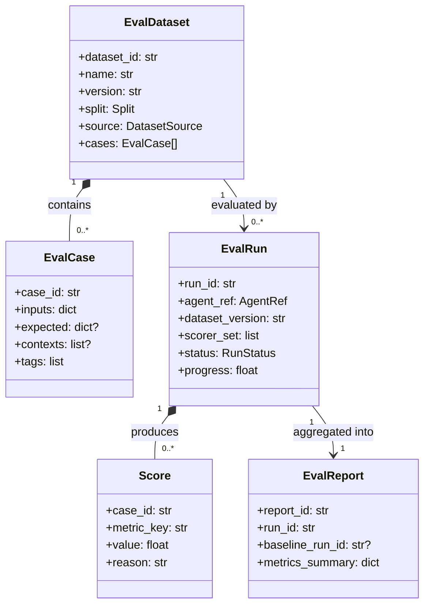
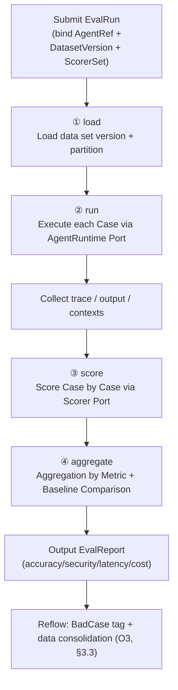
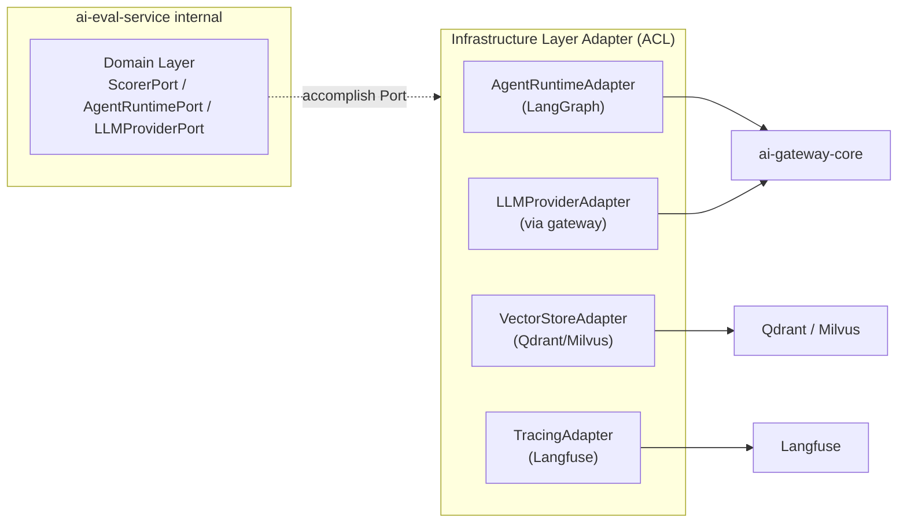
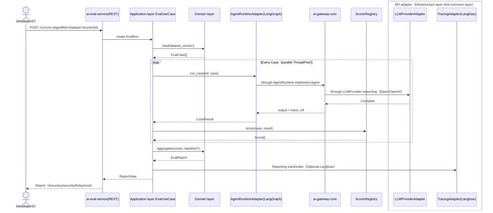
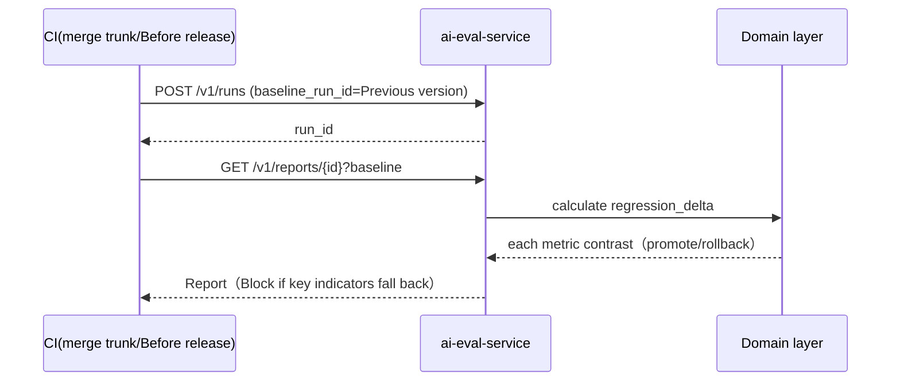
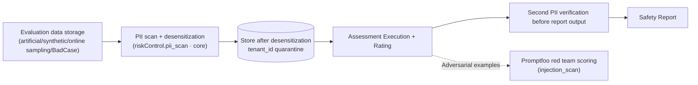

# ai-eval-service · Detailed design document (DESIGN)

> This document is the detailed design fact source of `ai-eval-service`. It inherits the `docs/ARCH.md` (positioning and boundaries), `docs/SPECS.md` (contract) and `docs/SKILLS.md` (coding skills) of this repository, and strictly aligns with the corresponding chapters of "OpenStrata Architecture Design Document v2.8". Major design decisions are recorded as ADRs in `docs/adr/`.

## Meta information (header)

| item | value |
| --- | --- |
| **repo** | `ai-eval-service`（polyrepo：`github.com/openstrata/ai-eval-service`，tag `v1.0.0`） |
| **Language · Framework** | Python · FastAPI + Pydantic v2 + Poetry (§15.5.1) |
| **domain** | ai-native (§15.2 / §15.2.1) |
| **Optional** | optional (off by default, lit on demand starting from phase 2/E4, §4.6 / §6 / §12.2) |
| **Platform version** | `v1.0.0` (corresponding to `openstrata-meta/repos.yaml`, `bom.yaml` released `2026-07-15`) |
| **Document Status** | Draft (Draft) |
| **Responsible Person** | OpenStrata Architecture Group |
| **Affiliated links** | This repository: [docs/ARCH.md](./ARCH.md) · [docs/SKILLS.md](./SKILLS.md) · [docs/SPECS.md](./SPECS.md); Architecture documents: §4.6 (MLOps and evaluation layer), §6 (Agent Full life cycle), §10.4 (SPI multiple implementations), §15.5 (self-developed service technology stack and DDD layering), §16 (release management and BOM/Eval SPI) |

---

## 1. Positioning and boundaries

`ai-eval-service` is OpenStrata's **Evaluation Service**, located in the `ai-native` domain. It is the engineering bearer of the "Evaluation Phase (§6.3)" and "MLOps and Evaluation Layer (§4.6)" in the Agent's full life cycle (§6). It uses `Eval` SPI (`interface_versions.Eval = 1.0.0` in `bom.yaml`) as a unified port to converge external evaluation frameworks such as Promptfoo / DeepEval / Ragas into orchestrated and replaceable evaluation capabilities within the platform.

**Single responsibility (only solves one thing)**: Assessment data management + Assessment execution + Metric scoring + Report aggregation. It is not responsible for Agent's online reasoning, online traffic monitoring (belongs to `ai-gateway-core` / Langfuse), nor is it responsible for model training (belongs to MLOps/MLflow, §4.6.1).

**Boundaries (separation of responsibilities with adjacent services)**:

| Dimensions | This service is responsible | Adjacent services/components are responsible |
| --- | --- | --- |
| Online Conversation/Inference | ❌ | `ai-gateway-core` (LLMProvider SPI, §4.4) |
| Agent runtime orchestration | ❌ (only "borrows" its execution evaluated object) | `ai-gateway-core` + AgentRuntime (LangGraph, §4.2.1 / §15.5.1) |
| Online LLM Tracking | ❌ | Langfuse (Tracing SPI, §4.8) |
| Evaluation Data **Definition and Execution** | ✅ | — |
| Evaluation report **display** | UI is handled by `ai-portal-frontend` / `ai-admin-frontend` | This service only produces structured Report |
| Model fine-tuning/experiment tracking | ❌ | MLflow (MLOps SPI, §4.6.1, stage 4) |

**Position in the layer**: It belongs to the "AI native" application layer capabilities and is adapted to the external evaluation framework via SPI. Cross-service collaboration follows §15.5.2.2 - the evaluation task (`EV` in the figure) is delivered asynchronously by `ai-platform-api`, and the output report is reflowed.

---

## 2. Responsibilities List

Split by DDD application layer use cases (§15.5.2), this service promises the following capabilities:

| # | Responsibilities | Description | Corresponding architecture chapters |
| --- | --- | --- | --- |
| R1 | **Evaluation Data Set Management** | Data set creation/versioning/division (Train·Eval·Test)/distribution analysis, Bad Case storage | §4.6.3 Evaluation data management |
| R2 | **Evaluation Use Case (Case) Management** | Input/expectation/context/label of a single Case (attribution labels such as illusion/safety/format) | §4.6.3 Label system |
| R3 | **Evaluation task arrangement** | Submit evaluation run, bind target Agent (AgentRuntime), select scorer set, progress tracking | §6.3 Evaluation stage |
| R4 | **Evaluation Execution (Run)** | Load data → Call AgentRuntime to execute → Collect trace/output | §4.6.2 / §6.3 |
| R5 | **Metric Score (Score)** | Score output through pluggable Scorer (Promptfoo/DeepEval/Ragas) | §16 Eval SPI |
| R6 | **Result aggregation and reporting** | Aggregate indicators, generate Report (accuracy/security/latency/cost, etc.), support regression comparison | §4.6.2 Evaluation system |
| R7 | **Regression / Security / RAG Evaluation** | Provides special evaluations such as regression comparison, red team injection (Promptfoo Red Team), RAG fidelity, etc. | §6.3 / §4.6.2 |
| R8 | **PII and data security** | PII scanning, desensitization, and access isolation of evaluation data sets | §4.7.4 Basic risk control (core) |

> Optional: R1–R7 all `optional`, with `eval` switch in `openstrata.yaml` turned on (§12.1). PII scanning (R8) reuses the platform's basic risk control `riskControl.pii_scan` (§12.1 core baseline). This service is connected to its port instead of self-developing.

---

## 3. Domain concepts and models (Eval Dataset / Case / Metric / Report)

The domain layer (§15.5.2 ③) defines the following aggregations and entities in a **purely logical, zero external dependency** manner. Core aggregate roots: `EvalDataset`, `EvalRun`, `EvalReport`.

### 3.1 Domain Vocabulary

| Concept | Meaning | Key attributes |
| --- | --- | --- |
| **EvalDataset** | A collection of evaluation use cases, with version | `dataset_id`, `name`, `version`, `split` (train/eval/test), `source` (artificial/synthetic/online sampling/BadCase), distribution metadata |
| **EvalCase** | Single evaluation case | `case_id`, `inputs`, optional `expected`/`reference`, RAG `contexts`, attribution `tags` |
| **Metric** | A scoring dimension (such as accuracy/fidelity/illusion rate) | `metric_key`, `scorer`, `direction` (max/min), threshold |
| **Score** | The score of a certain Case under a certain Metric | `case_id`, `metric_key`, `value`, `reason`, `trace_ref` |
| **EvalRun** | An evaluation execution (bound data set + Agent + scorer set) | `run_id`, `agent_ref`, `dataset_version`, `status`, `progress` |
| **EvalReport** | Aggregation results of a Run | `report_id`, `run_id`, each Metric aggregate value, comparison baseline |

### 3.2 Aggregation relationship (Mermaid)



### 3.3 Domain constraints (example)

- The `version` of `EvalDataset` is incremented by the domain service every time the content changes (semantic, docking §6.4 version management).
- `EvalRun.status` state machine: `pending → running → scoring → aggregated → done | failed`.
- `Score.value` must fall within the `[min, max]` declared by the Scorer, otherwise the domain layer rejects and marks the Run as `failed`.

---

## 4. Evaluation pipeline (load → run (bound AgentRuntime) → score → aggregate)

Evaluation execution is a core use case (`EvalUseCase`) of the application layer, which is promoted serially in four stages, and each stage can be expanded horizontally (ThreadPool/Ray is used for parallel evaluation, see §15.5.1 Python technology stack notes).



### 4.1 Key points of each stage

| Stages | Input | Processing | Output | Extension Points |
| --- | --- | --- | --- | --- |
| **load** | `dataset_version`, partition rules | Load Case from Repository, split by `split` | `EvalCase[]` | Data source pluggable (PG / Object Storage / Synthetic Generator) |
| **run** | `EvalCase[]`, `AgentRef` | Call the target Agent via `AgentRuntimePort`, passing in `inputs`/`contexts` | `CaseResult{output, trace_ref, latency, cost}` | AgentRuntime adapter (LangGraph et al., §10.3 I3) |
| **score** | `CaseResult[]`, `ScorerSet` | Call each `ScorerPort` in parallel for each Case | `Score[]` | **Scorer Plugin** (§5) |
| **aggregate** | `Score[]`, optional `baseline_run_id` | Aggregate by `metric_key` (mean/P95/pass rate), diff with baseline | `EvalReport` | Report rendering (Grafana/Markdown/Langfuse) |

### 4.2 Binding with AgentRuntime (core of run phase)

Evaluation is not about "implementing another Agent", but rather using the platform's existing AgentRuntime to run the object being evaluated. The application layer holds an `AgentRuntimePort` (domain layer definition, infrastructure layer implemented with LangGraph adapter, docking §4.2.1 / §15.5.1), locates the target Agent through `AgentRef` (including `agent_id`, `tenant_id`, version), and reuses its tool/memory/prompt configuration to ensure that "evaluation is real operation".

```python
# realm port（§15.5.2 ③ Define only the interface，Does not depend on implementation）
class AgentRuntimePort(Protocol):
    def run_case(self, ref: AgentRef, case: EvalCase) -> CaseResult:
        """Call the target Agent to execute a single evaluation case and return the output and observable trajectory reference."""
        ...
```

---

## 5. Indicator and scorer design (pluggable scorers, mapping §16 Eval SPI)

The scorer is the core of "pluggable": the domain layer defines **`ScorerPort`**, and each external evaluation framework implements this port as an **Adapter** (§10.3 I8 `EvalEngine` → `Promptfoo / DeepEval / OpenCompass`; this service focuses on the first two + Ragas). Adding a new scoring dimension = adding a new Adapter, **zero changes to the domain layer and existing use cases** (Dependency Inversion DIP, §15.5).

### 5.1 Scorer port and registration

```python
class ScorerPort(Protocol):
    scorer_key: str                       #Such as promptfoo_security / deepeval_hallucination / ragas_faithfulness
    supported_metrics: list[str]
    def score(self, case: EvalCase, result: CaseResult) -> list[Score]: ...

# Registry（ProviderSelector，§10.3）：according to run of scorer_set Select Registered Adapter
class ScorerRegistry:
    def get(self, scorer_key: str) -> ScorerPort: ...
```

### 5.2 Scorer ↔ §16 BOM Eval component mapping

`eval` capability (interface_version `Eval: 1.0.0`) taken from `openstrata-meta/bom.yaml`:

| Scorer (Adapter) | BOM component | version | license | status | enabled_by_default | SPI | Evaluation dimensions (§4.6.2) |
| --- | --- | --- | --- | --- | --- | --- | --- |
| `PromptfooScorer` | **promptfoo** | `0.90.0` | MIT | **core** | ✅ (Default) | `Eval` | Accuracy / Security / Consistency / Red Team Injection |
| `DeepEvalScorer` | **deepeval** | `2.0.0` | Apache-2.0 | optional | ❌ | `Eval` | Hallucination Rate / Toxicity / Bias / Format |
| `RagasScorer` | **ragas** | `0.2.0` | MIT | optional | ❌ | `Eval` | Fidelity / Answer Relevance / Contextual Accuracy |

> Mirror §10.4 "Multiple implementations coexist": three Scorers can be registered at the same time and combined on demand during `run`. `promptfoo` is the core default, DeepEval/Ragas is optional (it takes effect when it is lit, no code changes). This is consistent with `eval: [promptfoo, deepeval, ragas]` (§12.2) in the advanced/full profile.

### 5.3 Extension point contract (new grader step)

1. Implement `ScorerPort` in `infrastructure/adapters/` and encapsulate the corresponding framework CLI/SDK (`promptfoo eval` / `deepeval test run` / `ragas.evaluate`).
2. Register to `ScorerRegistry` with `scorer_key` (via dependency injection, §15.5.2).
3. If a new metric is required, declare `metric_key` + direction + threshold in the `Metric` enumeration at the domain layer; the aggregation logic will be automatically overwritten.
4. Provide SPI contract testing (§12 Compatibility / §16.1) to ensure that the `Eval: 1.0.0` port is not broken.

```yaml
# in the evaluation run request scorer_set choose（correspond §6.3 Review type）
scorer_set:
  - promptfoo_accuracy        #core default
  - promptfoo_security        #Red Team/Injection (§6.3 Security Assessment)
  - deepeval_hallucination    #optional, available after lighting deepeval
  - ragas_faithfulness        #optional, RAG scenario (§4.6.2)
```

---

## 6. Integration with LLM/vector library/model supply (Adapter)

The evaluation service itself does not hold ** model and vector capabilities, and is all accessed through the corresponding SPI Adapter (anti-corrosion layer ACL, §15.5.2) to ensure that multiple implementations of the same type can be switched and external semantics are not leaked.

| Dependency | SPI port | Default ✅ / Alternative (bom.yaml) | Purpose of this service | Adapter implementation |
| --- | --- | --- | --- | --- |
| Model supply | `LLMProvider` (`1.0.0`) | Qwen/OpenAI/Claude ✅ / Self-hosted vLLM·TGI (Phase 4·full) | Inference call of Agent in evaluation; can also be used for **synthetic data generation** (§4.6.3) | `LLMProviderAdapter` unified export via `ai-gateway-core` |
| Vector retrieval | `VectorStore` (`1.0.0`) | Qdrant ✅ / Milvus (optional) | RAG evaluation (Ragas) requires retrieval context fidelity | `VectorStoreAdapter` |
| Agent runtime | `AgentRuntime` (`1.0.0`) | LangGraph ✅ (Python) / Spring AI ✅ (Java) | Execute the evaluated Agent (§4.2 run phase) | `AgentRuntimeAdapter` (LangGraph) |
| LLM tracking | `Tracing` | Langfuse ✅ (MIT, optional) | Evaluation track traces, report correlation (§4.8) | `TracingAdapter` |
| Cache / KV | `Cache` (`1.0.0`) | Redis ✅ / Valkey (optional·OSI) | Temporary cache of task status and scoring results | `CacheAdapter` |
| Authentication and Authorization | `Auth` (`1.0.0`) | Keycloak ✅ | Tenant isolation and access control for datasets/reports | `AuthAdapter` |



> Consistent with §4.4.4 model supply: Stages 1 to 3 are only third-party LLM API (no GPU required); self-hosted inference (vLLM) is only in stage 4 full mode. When the evaluation requires "local model running scores", it is also switched through `LLMProvider` SPI, with zero changes to the evaluation use cases.

---

## 7. API Design (REST/SDK Contract)

The access layer (§15.5.2 ①) uses FastAPI to expose REST, and Pydantic v2 for Schema and verification. All write interfaces are injected into the tenant context via the `Auth` Port (`tenant_id` comes from Keycloak Token, §4.7).

### 7.1 REST Endpoint (Contract Summary)

| Method | Path | Use Case | Description |
| --- | --- | --- | --- |
| `POST` | `/v1/datasets` | R1 | Create dataset |
| `GET` | `/v1/datasets/{id}?version=` | R1 | Get the data set (including version) |
| `POST` | `/v1/datasets/{id}/cases` | R2 | New evaluation case |
| `POST` | `/v1/runs` | R3/R4 | Submit evaluation run (bind AgentRef + dataset version + scorer_set) |
| `GET` | `/v1/runs/{run_id}` | R3 | Query the running progress |
| `POST` | `/v1/runs/{run_id}/cancel` | R3 | Cancel run |
| `POST` | `/v1/runs/{run_id}/score` | R5 | Trigger/rerun scoring (scorer subset can be specified) |
| `GET` | `/v1/reports/{report_id}` | R6 | Get aggregate report (supports `?baseline=run_id` regression comparison) |
| `GET` | `/v1/reports/{report_id}/export?fmt=md\|json\|grafana` | R6 | Report export |

### 7.2 Key request/response Schema (Pydantic v2)

```python
from pydantic import BaseModel, Field
from enum import Enum

class Split(str, Enum):
    train = "train"; eval = "eval"; test = "test"

class AgentRef(BaseModel):
    agent_id: str
    tenant_id: str
    version: str | None = None          #If left blank, the current online version will be taken.

class RunCreate(BaseModel):
    dataset_id: str
    dataset_version: str
    agent: AgentRef
    scorer_set: list[str] = Field(..., min_length=1)   #See §5.3
    split: Split = Split.eval
    baseline_run_id: str | None = None   #regression vs. baseline

class RunStatus(str, Enum):
    pending = "pending"; running = "running"; scoring = "scoring"
    aggregated = "aggregated"; done = "done"; failed = "failed"

class RunView(BaseModel):
    run_id: str
    status: RunStatus
    progress: float = Field(ge=0, le=1)
    metrics_summary: dict = {}

class ReportView(BaseModel):
    report_id: str
    run_id: str
    baseline_run_id: str | None
    metrics_summary: dict[str, float]      #metric_key -> aggregate value
    regression_delta: dict[str, float] | None
```

### 7.3 SDK Contract (for `ai-sdk-python` consumers)

```python
from openstrata.sdk import EvalClient
client = EvalClient(base_url="http://ai-eval-service", token="<keycloak-token>")
run = client.runs.create(
    dataset_id="qa-golden", dataset_version="v3",
    agent={"agent_id": "customer-service", "tenant_id": "t-b"},
    scorer_set=["promptfoo_accuracy", "deepeval_hallucination"],
)
report = client.reports.wait(run.run_id)      #poll to done
print(report.metrics_summary)
```

> Compatibility commitment (echoing §16.1 SemVer): This service REST prefix `/v1`, SPI `Eval: 1.0.0`; destructive changes must bump `MAJOR` and be accompanied by ADR (see `docs/adr/`).

---

## 8. Data model and storage (dataset/result)

Storage follows §4.9 Base: `PostgreSQL 16` (relational/structured) + `Redis 7.4` (task state/cache, Valkey is OSI alternative). The domain layer is defined as **`EvalRepositoryPort`**, and the infrastructure layer is implemented in SQLAlchemy (§15.5.3 Python directory `infrastructure/`).

### 8.1 Core table (logical model)

```sql
-- Evaluation dataset（Versioning，echo §4.6.3 DVC Version tracking ideas，fall PG）
CREATE TABLE eval_dataset (
    dataset_id   TEXT,
    version      TEXT,
    name         TEXT,
    source       TEXT,            -- human|synthetic|online_sample|badcase
    split        TEXT,
    dist_meta    JSONB,           -- category/length/Difficulty distribution
    tenant_id    TEXT,
    created_at   TIMESTAMPTZ DEFAULT now(),
    PRIMARY KEY (dataset_id, version)
);

-- Evaluation use case
CREATE TABLE eval_case (
    case_id    TEXT PRIMARY KEY,
    dataset_id TEXT,
    version    TEXT,
    inputs     JSONB,
    expected   JSONB,
    contexts   JSONB,            -- RAG scene retrieval context
    tags       TEXT[],           -- attribution tag：hallucination|security|format|...
    FOREIGN KEY (dataset_id, version) REFERENCES eval_dataset
);

-- Evaluation run
CREATE TABLE eval_run (
    run_id        TEXT PRIMARY KEY,
    agent_ref     JSONB,
    dataset_id    TEXT,
    dataset_version TEXT,
    scorer_set   TEXT[],
    status        TEXT,
    progress      REAL,
    tenant_id     TEXT,
    baseline_run_id TEXT
);

-- Single score
CREATE TABLE eval_score (
    run_id     TEXT,
    case_id    TEXT,
    metric_key TEXT,
    value      REAL,
    reason     TEXT,
    PRIMARY KEY (run_id, case_id, metric_key)
);

-- Aggregation reporting
CREATE TABLE eval_report (
    report_id       TEXT PRIMARY KEY,
    run_id          TEXT,
    baseline_run_id TEXT,
    metrics_summary JSONB,
    regression_delta JSONB
);
```

### 8.2 Storage division of labor

| Data | Storage | Description |
| --- | --- | --- |
| Datasets / Use Cases / Runs / Scores / Reports | PostgreSQL | Persistent source of truth; versioned by `(dataset_id, version)` composite primary key |
| Running progress/scoring intermediate result cache | Redis | High concurrent reading and writing, idempotent deduplication |
| Large-scale synthetic data/trajectory attachment | Object storage (MinIO, optional) | Large volume does not fall into PG |
| Experimental indicator history (optional) | MLflow (stage four MLOps) | Cross-version trend, docking §4.6.1 |

> Data set division (Train/Eval/Test) is **logical division** (by `split` columns + configuration rules, §4.6.3), without physical replication, reducing storage costs.

---

## 9. Critical timing (Mermaid)

### 9.1 Submit evaluation run → report reflow (end-to-end, echo §15.5.2.2)



### 9.2 Regression evaluation (before version release, §6.3)



---

## 10. Configuration/deployment (usually CPU, optional GPU in stage 4)

### 10.1 Configuration fragment (this repository `infrastructure/config/`, echoes §15.6.3)

This repository only holds **local configuration fragments**, and the global configuration is rendered by the meta repository `openstrata-meta/dependencies/config/` (§15.6). Snippet example:

```yaml
# ai-eval-service/infrastructure/config/eval.yaml
eval:
  enabled: true
  #Scorer switch: core is on by default promptfoo, optional is on as needed (§16 / §12.2)
  scorers:
    promptfoo:  { enabled: true,  version: "0.90.0" }
    deepeval:   { enabled: false, version: "2.0.0" }   # optional
    ragas:      { enabled: false, version: "0.2.0" }   # optional
  execution:
    concurrency: 16            #Number of parallel evaluation threads
    backend: threadpool        #threadpool | ray (large data set)
  storage:
    postgres: { dsn_env: PGDSN }
    redis:    { enabled: true }   #core; valkey can be switched in compliance scenarios
  integrations:
    agentRuntime: langgraph        #Corresponds to AgentRuntime SPI default
    llmProvider:  [qwen-cloud, openai]   #via ai-gateway-core
    vectorStore:  qdrant                #RAG for evaluation, can be switched to milvus
    tracing:      langfuse              # optional
```

### 10.2 Deployment form (§12.2 Four-level prefabrication)

| Profile | Stage | Whether this service is included | Form/Resources |
| --- | --- | --- | --- |
| `starter` | 1. Early adopters | ❌ Default off | Usually no evaluation required (§6 "Minimum construction + operation") |
| `standard` | 2. Enhancement | Optional (light on `eval`) | K8s single tenant, **CPU is the main** |
| `advanced` | 3. Scaled governance | ✅ Contains (`eval: [promptfoo, deepeval, ragas]`) | Multi-team sharing, CPU |
| `full` | 4. Engineering and Autonomy | ✅ Included (full Eval) | + Self-hosted inference requires **GPU node** (only when evaluating local models) |

> **Resource Qualification**: Evaluation execution (running Agent, scoring) is usually **CPU load**; only when the evaluated object uses **self-hosted model (local-qwen-vllm, §11.2 Phase 4)**, GPU inference is triggered through `LLMProvider` - this service itself has no hard dependence on GPU (§4.4.4 / §4.9 GPU scheduling only takes effect in Phase 4).

### 10.3 Containers and Deliverables (§15.6.2)

- `Dockerfile`: `python:3.12-slim` base image, Poetry installation dependency; stateless priority, external configuration.
- `helm/`: Deployment + Service + (optional) HPA; linked rendering with `profiles/*.yaml` (§12.4 Dependency verification: `eval` needs to be turned on if `agentRuntime` and `modelProvider` are turned on).
- Scheduling: Kueue queue can be configured under `advanced/full` (§4.9), sharing the GPU pool with self-hosted inference (full only).

---

## 11. Observability/Security (Evaluation Data PII Processing)

### 11.1 Observability (§4.8)

| Pillars | Selection | Implementation of this service |
| --- | --- | --- |
| Basic Tracing + Audit (**core**) | OpenTelemetry + immutable audit log | Every Run/Score hits OTel Span (including `run_id`/`tenant_id`/`agent_id`); trace audit of all write operations |
| Metrics (recommended) | Prometheus + Grafana | Expose `eval_runs_total`, `eval_score_latency`, `scorer_errors`; reports can be directly `export?fmt=grafana` |
| LLM Special Tracing (optional) | Langfuse | Associating evaluation tracks and online links through `TracingAdapter` (`agent_execution` Span system of §4.8 example) |

### 11.2 Security and Evaluation Data PII Processing (§4.7.4)

Evaluation data often contains real user corpus (online sampling 1%, Bad Case, §4.6.3), and PII processing is a core security item:

| Measures | Implementation | Nature |
| --- | --- | --- |
| **PII scanning + desensitization** | Access the platform's basic risk control `riskControl.pii_scan` (§12.1 **core is enabled by default**) port, and perform NER detection and masking on `inputs`/`expected` before warehousing | core |
| **Injection/Jailbreak Detection** | Reuse `riskControl.injection_scan` (§4.7.4); the adversarial samples in the evaluation data set were scored by the red team with `promptfoo` | core |
| **Frequency Abnormality/Current Limitation** | `riskControl.rate_limit` Protection Evaluation API | core |
| **Tenant Isolation** | All datasets/report tables with `tenant_id`, enforce row level isolation via `Auth` Port (Keycloak) | core |
| **Output sensitive information detection** | After scoring, the results are verified twice by `pii_scan` to avoid the report leaking the original PII | core |
| **Advanced Guardrails (optional)** | Hallucination Detection / Compliance Rules / Manual Approval (§4.7.4 optional) enabled by the `security` switch | optional |



> **Design Principle**: This service **does not self-develop** PII/injection detection, and unifies the basic risk control port of the platform (§4.7.4 core baseline) to avoid duplication and policy drift; only declares the field constraint "evaluation data must pass the PII level" on the port.

---

## 12. Testing strategy

Follow §15.5.5 "Pure logic at the domain layer can be tested independently of the framework" + §15.5.2 cross-cutting convention. Divided into three layers:

| Layer | Type | Scope | Tool/Method |
| --- | --- | --- | --- |
| Domain layer | **Unit test** | `EvalDataset` versioning, `Score` interval verification, state machine, aggregation algorithm | pytest (pure function, no DB/framework) |
| Infrastructure layer | **Integration testing** | Adapter real behavior: PostgreSQL (Testcontainers), Redis, Promptfoo CLI calls | pytest + testcontainers; DeepEval/Ragas run through mock LLM |
| SPI / Port | **Contract Test** | `ScorerPort` / `AgentRuntimePort` / `EvalRepositoryPort` implementation satisfies port signature and `Eval: 1.0.0` semantics | Port consistency assertion + bom version verification (§16.1) |
| End-to-end | **E2E** | `POST /v1/runs` → Report, use fake Agent Adapter (do not adjust real LLM) | FastAPI TestClient + Memory Repository |

**Return to the red line**: CI integrates "evaluation self-evaluation" - this service runs a set of golden datasets before each release, and key metric rollbacks are blocked (echoing §6.3 regression testing + §11.2).

**Compatibility Test**: Verify that `bom.yaml` `interface_versions.Eval = 1.0.0` remains unchanged when the scorer Adapter is upgraded (§16.1 SemVer).

---

## 13. Open questions

1. **GPU Boundary**: GPU scheduling/quota attribution when evaluating local self-hosted models (vLLM) - does the service hold the GPU load directly, or is it always called remotely via `modelServing` from `ai-gateway-core`? (Incline towards the latter, keep this service without GPU hard dependency, §10.2)
2. **Multi-tenant data set isolation granularity**: `advanced` When shared by multiple teams, is the data set "tenant-level isolation" or "team/project level"? Needs to be aligned with the tenant model (§8.1 / §14) of `ai-platform-api`.
3. **Coupling of Ragas and VectorStore**: RAG evaluation needs to retrieve context (§4.6.2 Fidelity/Context Accuracy), is it mandatory that `vectorStore` is lit? How to declare dependency verification with §12.4 (`rag` depends on `memory`/`vectorStore`, evaluate whether it is the same).
4. **Report storage and long-term trends**: Will the cross-version indicator trend fall into PG, or will it be unified into MLflow (stage four MLOps)? It needs to be clearly assigned to the `mlops` switch (§12.1) to avoid double writing.
5. **Responsibility boundaries for synthetic data generation**: §4.6.3 Synthetic data is automatically generated by "LLM + manual review". Is the generator logic placed in this service or `ai-srs-service` / independent job? It is recommended that this service only consumes synthetic data and generates it through external pipelines.
6. **Relationship between Eval SPI and OpenCompass**: §10.3 I8 enumerates `EvalEngine → Promptfoo/DeepEval/OpenCompass`, but the `eval` capability of §4.6.2/bom.yaml only contains promptfoo/deepeval/ragas. Whether OpenCompass (model-level evaluation) is included in the Scorer system of this service or is only a `modelServing` side capability requires a decision by the architecture team.

---

## Change record

| Version | Date | Author | Description |
| --- | --- | --- | --- |
| v0.1 (draft) | 2026-07-17 | OpenStrata Architecture Group | Based on architecture v2.8 §4.6/§6/§10.4/§15.5/§16 and `bom.yaml` first version written 13 sections of detailed design |

## Traceability Matrix (Chapter of this document ↔ Architecture Design Document § Number)

| Chapters of this document | Architecture design document correspondence § | Key mapping points |
| --- | --- | --- |
| §1 Positioning and Boundary | §4.6 / §6 / §15.5.1 | ai-native domain; Eval is hosted by MLOps and evaluation layer |
| §2 Responsibilities List | §4.6.3 / §6.3 / §12.1 | Assessment Data Management / Evaluation Phase Use Cases |
| §3 Domain concepts | §4.6.2 / §4.6.3 | Dataset/Case/Metric/Report; label system, versioning |
| §4 Evaluation Pipeline | §6.3 / §4.6.2 / §15.5.2.2 | load→run→score→aggregate; bind AgentRuntime |
| §5 Scorer Design | §16 (Eval SPI) / §10.3 / §10.4 | promptfoo/deepeval/ragas ↔ BOM; multiple implementations coexist |
| §6 External Integration | §4.4.4 / §4.4.1 / §10.3 / §15.5.2 | LLMProvider / VectorStore / AgentRuntime / Tracing Adapter(ACL) |
| §7 API Design | §15.5.1 / §15.5.2 ① / §16.1 | FastAPI+Pydantic v2;/v1 and Eval:1.0.0 |
| §8 Data Model | §4.9 / §4.6.3 / §15.5.3 | PG16 + Redis; Versioned Composite Primary Key |
| §9 Critical Timing | §15.5.2.2 / §6.3 / §4.8 | Cross-service SPI calls; regression evaluation |
| §10 Configuration/Deployment | §12.1 / §12.2 / §4.9 / §11.2 | Four-level prefabrication; CPU as main, stage four as optional GPU |
| §11 Observable/Security | §4.8 / §4.7.4 / §12.1 | OTel+ audit core; PII/injection core risk control port |
| §12 Test Strategy | §15.5.5 / §16.1 | Domain Unit Test + SPI Contract + Compatibility |
| §13 Open Issues | §10.4 / §12.4 / §4.6.2 / §16 | Multiple Implementations / Dependency Checking / Scope Boundaries Pending |

> Associated meta repository: `openstrata-meta/repos.yaml` (`ai-eval-service`, optional), `bom.yaml` (`eval` capability: promptfoo 0.90.0 core / deepeval 2.0.0 optional / ragas 0.2.0 optional; `interface_versions.Eval = 1.0.0`), `profiles/advanced.yaml` & `profiles/full.yaml` (`eval: [promptfoo, deepeval, ragas]`).
